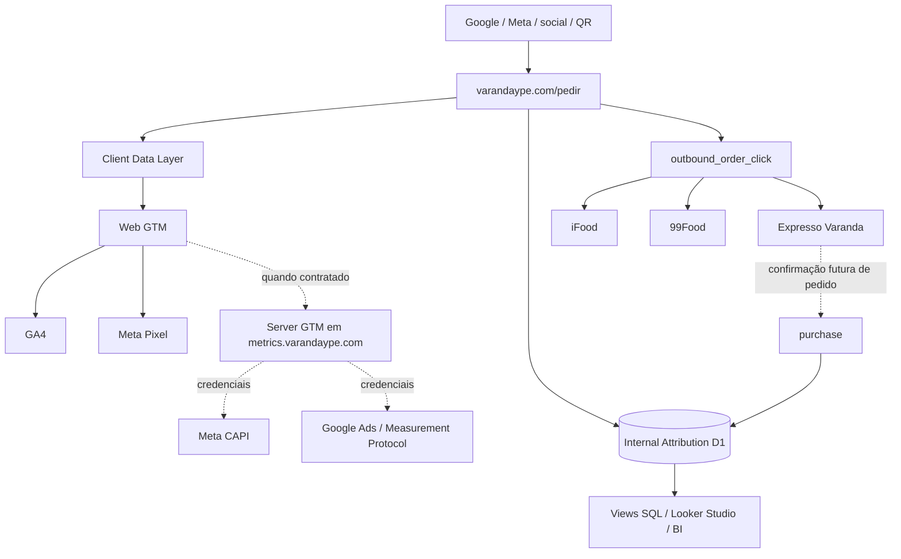

# Arquitetura

## Fluxo

1. Parâmetros conhecidos são normalizados sem alterar os valores recebidos.
2. Com consentimento de análise, `vy_vid` dura até 12 meses e `vy_sid` usa janela de 30 minutos. Sem consentimento, IDs existem apenas na memória da página e nada é persistido no D1.
3. O ledger local preserva first touch, last touch e até 25 touchpoints intermediários distintos.
4. Cada evento ganha UUID próprio. O mesmo `event_id` do dataLayer é enviado a `/api/marketing-event` para futura deduplicação browser/server.
5. O endpoint responde `202` e usa `waitUntil`; falhas nunca bloqueiam pedido.
6. D1 recebe visitantes, sessões, touchpoints, eventos, outbound conversions e exposições futuras. Não armazena IP bruto nem localização precisa.

## Decisões conservadoras

- Landings `/pedir` são `noindex,follow`; páginas orgânicas permanentes continuam separadas.
- Não há `Purchase`, `InitiateCheckout` ou receita em clique externo.
- Stape, CAPI, BigQuery, Enhanced Conversions e offline conversions estão desacoplados até haver contrato, credencial e fonte de venda comprovada.
- Ferramentas enterprise e provedores competitivos/geográficos são interfaces opcionais, sem SDK pesado.
